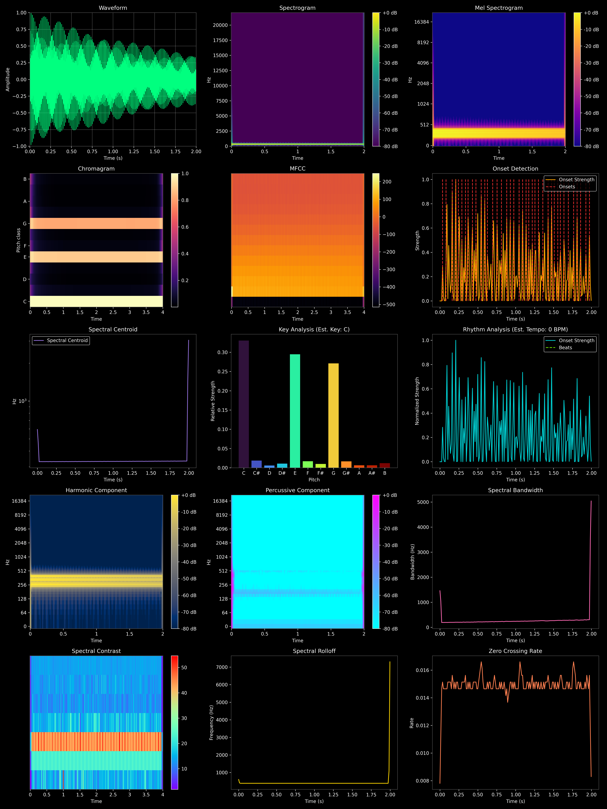

# MusicAITools - Music AI Processing Toolkit

MusicAITools is a versatile music processing toolkit that offers audio file processing, music file format conversion, and music analysis capabilities.

## Features

- **Audio Format Conversion**: Convert between WAV, MP3, OGG, FLAC and other formats
- **Audio to MIDI Conversion**: Automatically convert audio files to MIDI format
- **MIDI and MusicXML Conversion**: Support conversion between MIDI and MusicXML (music score format)
- **MusicXML Analysis**: Analyze score key, note statistics, and rhythm distribution
- **Instrument Conversion**: Modify instrument settings in MusicXML files
- **Audio Separation**: Separate mixed audio into vocals, drums, bass, and other instruments
- **Audio Visualization**: Generate comprehensive audio analysis visualizations with vibrant color schemes including waveform, spectrograms, chromagram, and more
- **Audio Restoration**: Enhance old recordings or low-quality audio


Future plans: Incorporate a comprehensive musical instrument timbre extraction feature, along with an audio restoration functionality.


## Installation

1. Clone the repository:
```bash
git clone https://github.com/yourusername/MusicAITools.git
cd MusicAITools
```

2. Install dependencies:
```bash
pip install -r requirements.txt
```

## Usage

### Command Line Interface

```bash
python main.py <command> [options]
```

Available commands:

1. **Audio Format Conversion**:
```bash
python main.py convert-format input.wav -f mp3 -o output.mp3
```

2. **Audio to MIDI**:
```bash
python main.py audio-to-midi input.wav -o output.mid
```

3. **MIDI to MusicXML**:
```bash
python main.py midi-to-xml input.mid -o output.musicxml
```

4. **MusicXML to MIDI**:
```bash
python main.py xml-to-midi input.musicxml -o output.mid
```

5. **Analyze MusicXML**:
```bash
python main.py analyze score.musicxml
```

6. **Change Instrument**:
```bash
python main.py change-instrument score.musicxml "Piano" -o new_score.musicxml
```

7. **Audio Separation**:
```bash
python main.py separate song.mp3 --output-dir separated_tracks
```

8. **Audio Visualization**:
```bash
python main.py visualize input.wav --output-file visualization.png
```

9. **Audio Restoration**:
```bash
python main.py restore old_recording.wav -o restored.wav --noise-reduction 0.3 --eq-high 1.3
```

## Advanced Audio Visualization

The toolkit provides comprehensive audio analysis through a powerful visualization module. The visualization includes 15 different types of audio analysis plots that help understand various audio characteristics, each with its own distinct color scheme for easier differentiation and better visual appeal.

### Visualization Types

1. **Waveform**: Time-domain representation of the audio signal showing amplitude variations over time, displayed in vibrant green.

2. **Spectrogram**: Visual representation of the spectrum of frequencies as they vary with time, showing the strength of different frequency components, using the viridis colormap.

3. **Mel Spectrogram**: Spectrogram that uses the mel scale, which is based on human hearing perception, providing a more perceptually relevant representation, displayed using the plasma colormap.

4. **Chromagram**: Displays the intensity of each pitch class (C, C#, D, etc.) over time, useful for analyzing harmonic content and key, rendered in magma colormap.

5. **MFCC (Mel-Frequency Cepstral Coefficients)**: Representation of the short-term power spectrum of a sound, widely used for timbre analysis, visualized with the inferno colormap.

6. **Onset Detection**: Identifies the beginnings of musical notes or events in an audio signal, showing note attacks with orange and red highlights.

7. **Spectral Centroid**: Represents the "center of mass" of the spectrum, indicating where the "brightness" of a sound is centered in the frequency spectrum, shown in purple.

8. **Key Analysis**: Estimates the musical key of the audio by analyzing the distribution of pitch classes throughout the recording, using a gradient color scheme for each pitch.

9. **Rhythm Analysis**: Analyzes the rhythmic patterns in music, including beat detection and tempo estimation in BPM (Beats Per Minute), with turquoise and chartreuse colors.

10. **Harmonic Component**: Shows the spectral content of the harmonic (tonal) part of the sound after source separation, using the cividis colormap.

11. **Percussive Component**: Shows the spectral content of the percussive (transient) part of the sound after source separation, displayed with the cool colormap.

12. **Spectral Bandwidth**: Measures the width of the spectral distribution, indicating how "spread out" the spectrum is around its centroid, shown in hot pink.

13. **Spectral Contrast**: Represents the level difference between peaks and valleys in the spectrum, useful for distinguishing between harmonic and percussive sounds, visualized with rainbow colors.

14. **Spectral Rolloff**: Frequency below which a specified percentage of the total spectral energy is contained, indicating the skew of the spectral shape, displayed in gold.

15. **Zero Crossing Rate**: Rate at which the signal changes from positive to negative or vice versa, often used to characterize percussive sounds, rendered in coral.

### Example Visualization



The visualization uses a dark background with distinct color schemes for each analysis type, providing a striking visual representation that makes it easier to identify different audio characteristics. This comprehensive analysis provides insights into various acoustic properties of the audio, helping with music analysis, genre classification, mood detection, and more. It can be particularly useful for musicians, audio engineers, music researchers, and anyone interested in understanding the characteristics of audio signals.

### Usage Example

```bash
# Basic usage
python main.py visualize input.wav -o output_visualization.png

# The visualization will be saved as a high-quality image (300 DPI)
```

## Project Structure

```
MusicAITools/
│
├── main.py               # Main program entry and CLI interface
├── requirements.txt      # Project dependencies
│
├── modules/              # Functional modules
│   ├── conversion/       # Format conversion related modules
│   │   ├── audio_to_midi.py
│   │   ├── midi_to_musicxml.py
│   │   ├── musicxml_to_midi.py
│   │   └── format_converter.py
│   │
│   ├── analysis/         # Music analysis related modules
│   │   └── musicxml_analyzer.py
│   │
│   ├── audio/            # Audio processing related modules
│   │   ├── separator.py
│   │   ├── visualizer.py
│   │   └── restoration.py
│   │
│   └── utils/            # Utility functions
│       └── helpers.py
│
└── tests/                # Test code
```

## License

MIT License
