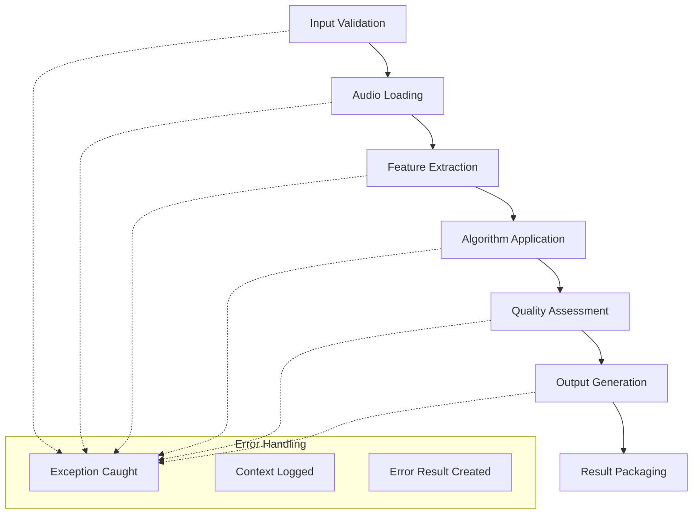

# 🏗️ Architecture Overview

MusicAITools is built on a modern, modular architecture designed for professional audio processing applications.

## 🎯 Design Principles

### 1. **Separation of Concerns**
Each layer has a clear, single responsibility:
- **Core Layer**: Foundation services (logging, config, exceptions)
- **Service Layer**: Business logic and processing algorithms
- **API Layer**: User interfaces and external integrations

### 2. **Type Safety**
Comprehensive type hints and data validation:
```python
def process(self, input_file: str, settings: Optional[Dict[str, Any]] = None) -> RestorationResult:
    """Type-safe method signatures throughout"""
```

### 3. **Error Resilience**
Graceful error handling with context:
```python
try:
    result = service.process(audio_file)
except AudioProcessingError as e:
    logger.error(f"Processing failed: {e.message}", extra=e.details)
```

### 4. **Performance Monitoring**
Built-in performance tracking:
```python
with self._performance_monitor("audio_loading"):
    audio_data = self._load_audio(file_path)
```

## 📁 Project Structure

```
MusicAITools/
├── modules/
│   ├── core/                    # 🔧 Foundation Layer
│   │   ├── __init__.py         # Public API exports
│   │   ├── exceptions.py       # Exception hierarchy
│   │   ├── logger.py           # Logging system
│   │   ├── config.py           # Configuration management
│   │   ├── models.py           # Data models
│   │   └── base_service.py     # Service base class
│   ├── audio/                   # 🎵 Audio Processing Layer
│   │   └── restoration_service.py
│   ├── conversion/              # 🔄 Format Conversion Layer
│   ├── analysis/                # 📊 Analysis Layer
│   └── utils/                   # 🛠️ Utility Layer
├── tests/                       # 🧪 Test Suite
│   └── test_core_architecture.py
├── docs/                        # 📖 Documentation
├── config.yaml                 # ⚙️ Default Configuration
└── test_new_architecture.py    # 🎯 Demo Script
```

## 🔧 Core Layer Components

### Exception Hierarchy

```python
MusicAIToolsException           # Base exception
├── AudioProcessingError        # Audio operation failures
├── FileNotFoundError          # Missing file errors
├── InvalidFormatError         # Format/codec issues
├── ConfigurationError         # Config validation failures
├── ModelLoadError             # ML model loading issues
└── ValidationError            # Data validation failures
```

**Usage Pattern:**
```python
try:
    result = service.process_audio(file_path)
except FileNotFoundError as e:
    handle_missing_file(e)
except AudioProcessingError as e:
    handle_processing_failure(e)
except MusicAIToolsException as e:
    handle_generic_error(e)
```

### Logging System

**Singleton Logger Manager:**
```python
class MusicAILogger:
    """Centralized logging with performance monitoring"""
    
    def log_performance(self, operation: str, duration: float, details: Dict[str, Any]):
        """Log operation performance metrics"""
        
    def log_error_with_context(self, error: Exception, context: Dict[str, Any]):
        """Log errors with structured context"""
```

**Usage:**
```python
from modules.core import get_logger

logger = get_logger()
logger.info("Processing started")
logger.error("Operation failed", extra={"file": "audio.wav", "size": 1024})
```

### Configuration Management

**Hierarchical Configuration:**
```python
@dataclass
class MusicAIConfig:
    audio_restoration: AudioRestorationConfig
    audio_separation: AudioSeparationConfig
    visualization: VisualizationConfig
    conversion: ConversionConfig
    system: SystemConfig
```

**Loading Priority:**
1. Default values (code)
2. Configuration file (YAML/JSON)
3. Environment variables
4. Runtime overrides

### Data Models

**Structured Results:**
```python
@dataclass
class ProcessingResult:
    status: ProcessingStatus
    output_files: List[Path]
    metadata: Dict[str, Any]
    error_message: Optional[str]
    processing_time: Optional[float]
    
    @property
    def success(self) -> bool:
        return self.status == ProcessingStatus.SUCCESS
```

**Type-Safe Audio Representation:**
```python
@dataclass
class AudioFile:
    path: Path
    sample_rate: Optional[int]
    duration: Optional[float]
    channels: Optional[int]
    format: Optional[AudioFormat]
    
    def validate(self) -> None:
        """Validate file properties"""
```

## 🎵 Service Layer Architecture

### Base Service Pattern

**Abstract Base Class:**
```python
class BaseService(ABC):
    """Template method pattern for all services"""
    
    @abstractmethod
    def process(self, input_data: Any, **kwargs) -> ProcessingResult:
        """Core processing logic - implemented by subclasses"""
        pass
    
    def safe_process(self, input_data: Any, **kwargs) -> ProcessingResult:
        """Safe wrapper with error handling and monitoring"""
        start_time = time.time()
        
        try:
            # Pre-processing validation
            self._validate_input(input_data, **kwargs)
            
            # Execute main processing
            result = self.process(input_data, **kwargs)
            
            # Post-processing validation
            self._validate_result(result)
            
            return result
            
        except Exception as e:
            return self._create_error_result(str(e))
```

### Service Features

**1. Automatic Error Handling**
```python
# Service automatically catches and wraps exceptions
result = service.safe_process("audio.wav")
if result.failed:
    print(f"Error: {result.error_message}")
```

**2. Performance Monitoring**
```python
# Automatic timing and resource tracking
print(f"Processing took {result.processing_time:.2f}s")
print(f"Service stats: {service.get_stats()}")
```

**3. Batch Processing**
```python
# Built-in batch processing with progress tracking
batch_result = service.process_batch(audio_files)
print(f"Success rate: {batch_result.success_rate:.1f}%")
```

**4. Statistical Tracking**
```python
# Per-service statistics
stats = service.get_stats()
print(f"Total operations: {stats['total_operations']}")
print(f"Average time: {stats['average_processing_time']:.2f}s")
```

## 🔄 Processing Pipeline Flow

### Standard Processing Flow



### Example: Audio Restoration Pipeline

```python
def process(self, input_file: str, **kwargs) -> RestorationResult:
    """Audio restoration processing pipeline"""
    
    # 1. Input validation
    audio_file = self._validate_audio_file(input_file)
    
    # 2. Configuration merging
    settings = self._merge_settings(kwargs.get('custom_settings'))
    
    # 3. Audio loading with monitoring
    with self._performance_monitor("audio_loading"):
        audio_data, sample_rate = self._load_audio(audio_file.path)
    
    # 4. Processing pipeline
    with self._performance_monitor("restoration_pipeline"):
        restored_audio = self._apply_restoration_pipeline(
            audio_data, sample_rate, settings
        )
    
    # 5. Quality assessment
    with self._performance_monitor("quality_assessment"):
        metrics = self._calculate_improvement_metrics(
            audio_data, restored_audio, sample_rate
        )
    
    # 6. Output generation
    output_path = self._generate_output_path(audio_file, kwargs.get('output_file'))
    self._save_audio(restored_audio, sample_rate, output_path)
    
    # 7. Result packaging
    return RestorationResult(
        status=ProcessingStatus.SUCCESS,
        restored_file=output_path,
        improvement_metrics=metrics,
        processing_time=processing_time
    )
```

## 🎛️ Extension Points

### 1. Custom Services

```python
class CustomAudioService(BaseService):
    """Extend framework with new audio processing"""
    
    def __init__(self):
        super().__init__("CustomAudio")
    
    def process(self, input_data: Any, **kwargs) -> ProcessingResult:
        # Implement custom processing logic
        # Inherit error handling, monitoring, batch processing
        pass
```

### 2. Custom Data Models

```python
@dataclass
class CustomResult(ProcessingResult):
    """Extend with domain-specific results"""
    custom_metrics: Dict[str, float] = field(default_factory=dict)
    algorithm_parameters: Dict[str, Any] = field(default_factory=dict)
```

### 3. Configuration Extensions

```python
@dataclass
class CustomConfig:
    """Add custom configuration sections"""
    algorithm_specific_param: float = 1.0
    feature_extraction_mode: str = "advanced"
    
    def validate(self) -> None:
        if not 0.0 <= self.algorithm_specific_param <= 2.0:
            raise ValidationError("Parameter out of range")
```

## 🔍 Design Patterns Used

### 1. **Singleton Pattern**
- Logger manager
- Configuration manager
- Ensures single source of truth

### 2. **Template Method Pattern**
- BaseService defines processing flow
- Subclasses implement specific algorithms
- Guarantees consistent behavior

### 3. **Strategy Pattern**
- Multiple algorithm implementations
- Runtime algorithm selection
- Easy to add new strategies

### 4. **Factory Pattern**
- Service creation and management
- Dynamic service instantiation
- Dependency injection support

### 5. **Observer Pattern**
- Progress monitoring
- Event-driven processing
- Extensible notification system

## 📊 Quality Attributes

### Performance
- **Monitoring**: Built-in performance tracking
- **Caching**: Intelligent feature caching
- **Parallelization**: Batch processing support
- **Memory Management**: Efficient resource usage

### Reliability
- **Error Handling**: Comprehensive exception hierarchy
- **Validation**: Input/output validation
- **Graceful Degradation**: Fallback mechanisms
- **Recovery**: Automatic error recovery where possible

### Maintainability
- **Modular Design**: Clear separation of concerns
- **Type Safety**: Comprehensive type hints
- **Documentation**: Inline and external docs
- **Testing**: Comprehensive test coverage

### Extensibility
- **Plugin Architecture**: Easy to add new services
- **Configuration**: Flexible configuration system
- **Abstraction**: Well-defined interfaces
- **Backwards Compatibility**: API versioning support

## 🚀 Future Architecture Enhancements

### Planned Improvements
1. **Microservices Support**: Distributed processing
2. **Plugin System**: Dynamic service loading
3. **Web API**: REST/GraphQL interfaces
4. **Streaming**: Real-time audio processing
5. **Cloud Integration**: AWS/GCP/Azure support

---

This architecture provides a solid foundation for building sophisticated music AI applications while maintaining code quality, performance, and extensibility.